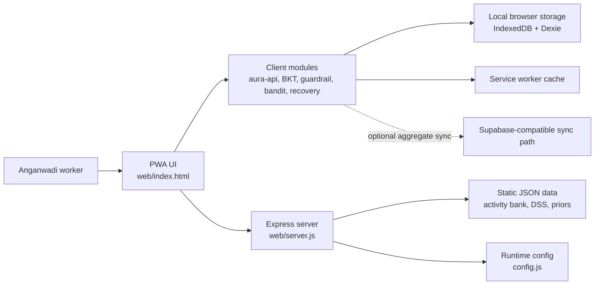
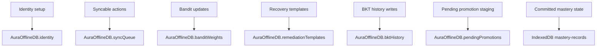
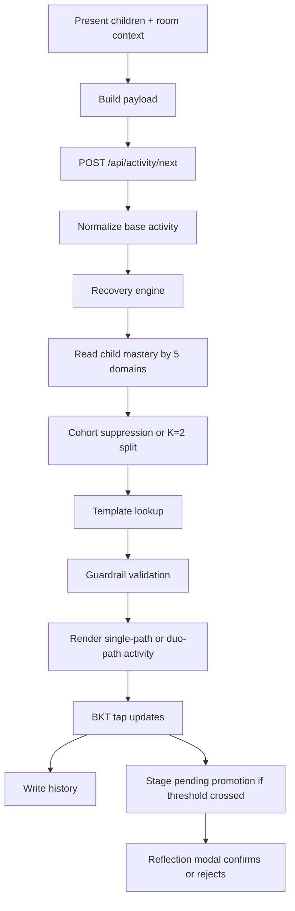

# A.U.R.A.

Anganwadi Unified Resource Assistant is an offline-first Progressive Web App for Anganwadi workers. It runs on low-cost mobile devices, digitizes Navchetana-based developmental screening, tracks child milestone progress, and adapts daily ECCE activities to the children and room context available in the moment.

Live deployment: [https://a-u-r-a-s7jf.onrender.com/](https://a-u-r-a-s7jf.onrender.com/)

## Overview

A.U.R.A. is designed for low-connectivity field use. The app keeps core interaction inside the browser, stores state locally, and degrades gracefully when the network is unavailable. The current codebase focuses on:

- attendance and child roster handling
- Navchetana-based ECE activity delivery
- DSS screening with age-based child filtering
- Bayesian Knowledge Tracing for child milestone progress
- guardrail validation for safety and inclusion
- recovery support through cohorting, reflection review, and local forecasting
- offline queueing and zero-PII sync primitives

## What Is Implemented Today

### Frontend

The live product surface is the `web/` PWA, not the `src/` reference layer.

Current user-facing screens include:

- splash and profile setup/login
- home dashboard
- attendance
- ECE activity
- DSS screening
- day review
- more/settings
- child roster management

The ECE flow currently supports:

- room-aware activity adaptation
- offline fallback activity resolution
- BKT tap updates per child
- recovery insight chips
- duo-path recovery guidance for a selected beta cohort
- pending promotion review through a reflection modal

### Intelligence and local logic

The current runtime includes:

- `web/bkt_engine.js`
  - per-child, per-node Bayesian Knowledge Tracing
  - rolling history and trajectory flags
  - pending promotion staging at high mastery confidence
- `web/guardrail_engine.js`
  - deterministic safety and inclusion checks
- `web/bandit_engine.js`
  - local contextual reward-weight updates
- `web/recovery_engine.js`
  - 5-domain recovery cohorting
  - duo-path assembly
  - local forecasting from stored history

### Data model ground truth

The activity system currently uses these 5 domains:

- `cognitive`
- `language`
- `motor_physical`
- `socio_emotional`
- `creative`

These are the ground truth for activity adaptation and recovery logic.

DSS is a separate screening model and should not be treated as the same domain system.

## Architecture

### System diagram



### Runtime responsibilities

- `web/index.html` is the main application shell and screen renderer.
- `web/server.js` serves the PWA, static data, and current backend endpoints.
- `web/aura-api.js` is the browser-side integration layer for local storage, queueing, and API calls.
- `web/bkt_engine.js` manages child mastery state.
- `web/guardrail_engine.js` validates activity safety and inclusion fit.
- `web/bandit_engine.js` stores and updates local reward weights.
- `web/recovery_engine.js` adds cohorting, duo-path recovery guidance, and forecasting.

### 1. PWA runtime

The browser app is served from `web/index.html` and its ES modules. It handles:

- UI rendering
- local storage and IndexedDB access
- offline fallbacks
- client-side BKT and recovery logic
- service worker registration

### 2. Express server

`web/server.js` serves the PWA and a small set of backend endpoints used by the current runtime.

Current server routes:

- `GET /config.js`
- `POST /api/mastery/tap`
- `GET /api/mastery/aggregate/:node_id`
- `POST /api/activity/next`
- `GET /api/children`
- `POST /api/children`

Important note:

- Attendance and meal submission are queued client-side in the current app flow.
- The frontend can attempt `POST /api/attendance` and `POST /api/meal`, but those endpoints are not implemented in the shipped `web/server.js` at this time.

### 3. Local persistence

The app currently uses two browser-side persistence layers:

- `mastery-records` in IndexedDB for mastery state
- `AuraOfflineDB` in Dexie for:
  - sync queue
  - key-value state
  - bandit weights
  - identity
  - BKT history
  - pending promotions
  - remediation templates

### Local data diagram



### 4. Offline behavior

The app is service-worker enabled and caches core shell assets plus curriculum data. Core user flows are designed to continue with local state and cached data when the network is unavailable.

### ECE adaptation and recovery flow



### Request and data flow summary

- Child roster is loaded from `GET /api/children` and cached locally.
- Activity requests are sent to `POST /api/activity/next`.
- Recovery enrichment happens in the browser after the base activity is resolved.
- BKT writes committed mastery into `mastery-records`.
- Higher-confidence milestone changes are first staged in `pendingPromotions`.
- Reflection review decides whether staged promotions are committed.
- When online sync is available, queued aggregate-safe data can be sent later.

## Repository Structure

```text
A.U.R.A/
|-- web/
|   |-- index.html
|   |-- server.js
|   |-- aura-api.js
|   |-- bkt_engine.js
|   |-- bandit_engine.js
|   |-- guardrail_engine.js
|   |-- recovery_engine.js
|   |-- sw.js
|   |-- manifest.json
|   |-- data/
|   |-- schema/
|   |-- tests/
|   `-- ml_pipeline/
|-- src/
|   `-- reference TypeScript core
|-- package.json
|-- Dockerfile
|-- DEPLOYMENT.md
`-- README.md
```

## Tech Stack

- Node.js
- Express
- HTML/CSS/JavaScript modules
- Dexie.js
- IndexedDB
- Service Worker APIs
- Web Speech API for limited non-PII voice capture
- Vitest for root TypeScript-side tests
- Node test runner for `web/tests`

## API Surface

### Implemented server endpoints

| Method | Route | Purpose |
| --- | --- | --- |
| `GET` | `/config.js` | Inject runtime environment config into the client |
| `POST` | `/api/mastery/tap` | Server-side mastery tap endpoint |
| `GET` | `/api/mastery/aggregate/:node_id` | Aggregate mastery summary for a node |
| `POST` | `/api/activity/next` | Resolve the next activity candidate |
| `GET` | `/api/children` | Fetch child roster |
| `POST` | `/api/children` | Register a child |

### Frontend-queued but not shipped as server routes here

These are used by the frontend queueing model, but are not implemented in the current `web/server.js`:

- `POST /api/attendance`
- `POST /api/meal`

## Getting Started

### Prerequisites

- Node.js 18 or newer
- npm

### Install

```bash
npm install
```

### Run the app locally

```bash
npm start
```

Then open:

- [http://localhost:3000](http://localhost:3000)

The root start script runs `node web/server.js`.

## Environment Configuration

The server exposes runtime configuration through `GET /config.js`.

Supported environment variables:

- `PORT`
- `SUPABASE_URL`
- `SUPABASE_KEY`

Local example:

```js
window.ENV = {
  SUPABASE_URL: "YOUR_SUPABASE_URL_HERE",
  SUPABASE_KEY: "YOUR_SUPABASE_KEY_HERE"
};
```

See `web/config.example.js`.

## Testing

### Root tests

Run the TypeScript-side verification suite:

```bash
npm test
```

### Web runtime tests

Run the browser-runtime unit tests from the `web` package:

```bash
cd web
npm test
```

## Operations Notes

### PWA behavior

- The app registers `web/sw.js` when supported by the browser.
- `web/manifest.json` enables installable PWA behavior.
- HTTPS is strongly recommended for real installability and stable service worker behavior.

### Recovery feature behavior

- Recovery cohorting uses the current 5-domain activity model.
- Duo-path activities are additive wrappers around the base activity flow.
- Forecasting is advisory only and does not auto-change milestones or activities.
- Reflection review is the final gate before committing staged promotions.

## Deployment

The project is already deployed on Render:

- [https://a-u-r-a-s7jf.onrender.com/](https://a-u-r-a-s7jf.onrender.com/)

For local production-style container execution:

```bash
docker build -t aura-app .
docker run -p 3000:3000 aura-app
```

The current Docker entrypoint runs:

```bash
node web/server.js
```

More deployment detail is available in `DEPLOYMENT.md`.

## Data Sources

The current codebase uses local JSON assets under `web/data/`, including:

- activity bank data
- milestone priors
- DSS screening data
- remediation templates

The app is currently aligned to Navchetana-based activity and screening data in the shipped runtime.

## Security and Privacy

Current privacy approach:

- child-facing logic is designed to stay local-first
- sync uses queue-based client logic
- identity is stored locally with hashed PIN verification
- the intended cloud sync model is zero-PII and aggregate-oriented

This does not mean every operational deployment is automatically privacy-complete. You should still review your server configuration, cloud keys, access controls, and data handling before production use.

## Current Limitations

- The main production UI is still a single-file PWA shell in `web/index.html`.
- Some frontend flows queue data locally even when matching backend endpoints are not yet implemented on the server.
- The `src/` TypeScript layer is useful reference code, but the `web/` runtime is the real product surface.
- Manual browser verification is still essential before production pushes, especially for offline and PWA behavior.

## Recommended Manual Smoke Test

Before a production release, verify:

1. login or signup works
2. child roster loads correctly
3. attendance can be marked
4. ECE activity loads online
5. offline fallback activity still loads when the server path is unavailable
6. BKT taps update child state as expected
7. pending promotion review opens and confirms correctly
8. DSS still filters questions by child age
9. service worker registration succeeds on HTTPS deployment

## License

This repository is marked `UNLICENSED`.
